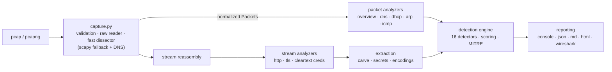

# NetSleuth — Open-Source PCAP Analysis & Network Threat Hunting Toolkit

**Give the analyst the answer — but show the evidence and reasoning behind it.**

NetSleuth turns a `.pcap`/`.pcapng` file into an investigation: who talked to
whom, what protocols were used, what DNS/HTTP/TLS really did, which files were
transferred, what credentials and flags leaked, which behavior looks malicious
— and, for every finding, the Wireshark display filter to verify it yourself.

It is built for security students, SOC analysts, incident responders, CTF
players and researchers who know *something bad is in this capture* but
shouldn't need to read 50,000 packets by hand to find it.

```
$ netsleuth detect examples/demo.pcap

┌─────── Detection Summary ────────┐
│  RISK SCORE 100/100 — CRITICAL   │
└──────────────────────────────────┘

 HIGH  Periodic connections: 192.168.1.50 → 198.51.100.66:4444
       (12 connections, ~60.0s interval)  (confidence: high)
       192.168.1.50 connected to 198.51.100.66:4444 12 times with a
       mean interval of 60.0s and low timing variance (CV=0.00).
       evidence: connections: 12
       Wireshark: ip.addr == 198.51.100.66 && tcp.port == 4444

 HIGH  Possible DNS tunneling via c2bad.example  (confidence: high)
       30 queries show unusually long labels (max 39 chars); high-entropy
       labels (max 4.529 bits/char); 30 unique subdomains; 30 TXT responses.
       evidence: signals fired: 4
       Wireshark: dns.qry.name contains "c2bad.example"

 HIGH  Cleartext FTP credentials observed …  HIGH  Possible port scan …
```

> **Defensive by design.** NetSleuth only ever *reads* capture files. It has
> no packet-sending, no live-capture and no exploit functionality — it is an
> analysis and teaching tool, not an attack tool.

## Why this exists

Wireshark shows you *packets*; Zeek shows you *logs*. Between them sits the
job most analysts actually have: "here is a capture — tell me the story."
NetSleuth automates that first pass:

* **Explains itself** — every finding carries its evidence, a plain-English
  "why it matters", a confidence level, and the exact Wireshark filter to
  reproduce the finding by hand. It distinguishes *observed fact* from
  *inference* from *suspicion*, and never calls weak indicators malware.
* **CTF-aware** — a dedicated mode hunts flag patterns, encoded blobs
  (base64/base32/hex/URL, chains included), single-byte-XOR flags, DNS TXT
  and ICMP hiding spots, and explains where each candidate came from so you
  learn to find them yourself.
* **Beginner-friendly** — `netsleuth analyze` walks an 11-step guided
  investigation; `docs/network-basics.md` teaches packets, streams, DNS,
  TLS and every detection concept in plain English first.

## Features

| Area | What you get |
|---|---|
| Ingestion | pcap + pcapng (both endiannesses, µs/ns, gzip), truncation detection, structural pre-scan, streaming (no full-file loads) |
| Visibility | hosts (internal/external, DNS-learned hostnames, MAC vendors), conversations, top talkers, protocol/L7 counts |
| TCP | full stream reassembly (retransmits, out-of-order, gaps counted), follow-stream view, `tcp.stream`-style indexing |
| DNS | full query inventory, per-domain stats, NXDOMAIN rates, TXT collection, entropy/label-length analytics |
| HTTP | request/response pairs from streams (keep-alive, chunked, gzip with bomb-guard), POST bodies, headers, carving |
| TLS | SNI, versions, ALPN, JA3 (GREASE-aware), X.509 subject/issuer/validity/self-signed via minimal DER walk — metadata only, no decryption claims |
| Cleartext protocols | FTP/SMTP/IMAP/POP3 credentials, SMTP envelope + MIME attachments, HTTP Basic, SSH/telnet banners, DHCP |
| Extraction | magic-byte file typing, SHA-256/1/MD5, sanitized filenames, path-traversal-proof writer, size budgets |
| Secrets | YAML rule engine: CTF flags, passwords, API keys, tokens, private keys, connection strings; `--pattern` ad-hoc regexes; masked by default |
| Detection | SYN/host scanning, beaconing (interval CV statistics, TCP + DNS), DNS tunneling (multi-signal), NXDOMAIN anomalies, HTTP attack patterns, ARP conflicts, ICMP data, cleartext creds, bulk exfiltration, risky ports |
| Scoring | documented 0–100 risk score (strongest finding dominates; confidence-weighted) — a triage signal, not a verdict |
| ATT&CK | MITRE mappings with per-finding justification, only where evidence supports it |
| Reports | rich console, JSON, Markdown, self-contained HTML (no scripts/CDNs, everything escaped) |
| Wireshark companion | per-finding and per-entity display filters — "here's how to check me" |
| Covert channels | generic protocol-metadata engine: finds fields whose values encode information (HTTP version, DNS qtype, TTL, IP ID…), maps value sequences to bitstreams, decodes with full provenance — [docs/covert-channels.md](docs/covert-channels.md) |

## Architecture



One streaming pass feeds the analyzers; a finalize stage then does stream
reassembly → HTTP/TLS/credential parsing → carving → secret scanning →
detection. Everything downstream of the dissector speaks plain dataclasses
(`models.py`), so every layer is unit-testable without a capture — and
detectors are pure functions over the analysis result.

Full decision log (and rejected alternatives): **[docs/DESIGN.md](docs/DESIGN.md)**.

## Install

Python 3.10+ (developed on 3.14; Windows/Linux/macOS).

```bash
git clone <this-repo> && cd netsleuth
pip install .            # or:  pip install -e .[dev]  for development

netsleuth --help         # or:  python -m netsleuth --help
```

Dependencies: `scapy` (parsing), `typer` + `rich` (CLI), `PyYAML` (rules) —
deliberately minimal; see DESIGN.md for why (and why there is no tshark/Zeek
requirement).

## Quick start

```bash
# regenerate the bundled synthetic incident capture
python examples/generate_demo.py examples/demo.pcap

netsleuth analyze examples/demo.pcap        # guided 11-step investigation
netsleuth detect examples/demo.pcap -v      # findings + full evidence
netsleuth report examples/demo.pcap --format html --output report.html
```

### The command set

#### Initial Triage & Reconnaissance

Get a high-level summary of the capture file (packet counts, duration, etc.):
```bash
netsleuth summary yourfile.pcap
```

Map out all hosts, conversations, and top talkers in the network:
```bash
netsleuth hosts yourfile.pcap
```

Run a guided, 11-step interactive investigation of the capture:
```bash
netsleuth analyze yourfile.pcap
```

#### Protocol Specific Analysis

Inventory all DNS queries and detect potential DNS tunneling:
```bash
netsleuth dns yourfile.pcap
```

Extract and view HTTP transactions directly from reassembled streams:
```bash
netsleuth http yourfile.pcap
```

Analyze TLS metadata (SNI, JA3 fingerprints, certificate details) without decryption:
```bash
netsleuth tls yourfile.pcap
```

#### Deep Dive & Payload Extraction

List all reconstructed TCP streams in the capture:
```bash
netsleuth streams yourfile.pcap
```

Follow a specific TCP stream (e.g., stream 42) to view its payload:
```bash
netsleuth stream yourfile.pcap 42 --hex
```

Carve and extract files from the PCAP, automatically verifying magic bytes and hashing them:
```bash
netsleuth extract yourfile.pcap -o ./extracted_files/
```

#### Threat Hunting & Detection

Run the full detection engine to calculate a risk score and map to MITRE ATT&CK:
```bash
netsleuth detect yourfile.pcap -v
```

Hunt for hidden secrets, credentials, API keys, and CTF flags:
```bash
netsleuth secrets yourfile.pcap --reveal
```

Perform advanced metadata covert-channel analysis (finding data hidden in protocol headers):
```bash
netsleuth covert yourfile.pcap
```

Generate a chronological timeline of all significant events and findings:
```bash
netsleuth timeline yourfile.pcap --severity HIGH
```

#### Reporting

Generate a standalone, interactive HTML report of the entire investigation:
```bash
netsleuth report yourfile.pcap --format html --output report.html
```

Output findings in JSON format for integration with SIEMs/dashboards:
```bash
netsleuth report yourfile.pcap --format json --output report.json
```

Common options: `--json`, `--verbose`, `--max-packets N`, `--rules FILE`
(on secrets/detect/ctf/report/analyze), `--reveal`.

### CTF example

```bash
$ netsleuth ctf examples/demo.pcap --reveal
Flag candidates
 1  picoCTF{f0ll0w_th3_str3ams}  high
    regex 'ctf.flag.named' matched in reassembled stream (server→client);
    open with: netsleuth stream 84

Where data hides — checklist for this capture:
  • DNS TXT records: 30 seen (inspect them!)
  • ICMP payloads: 6 (data inside ping!)
  • Streams on unusual ports: 13
```

The mode also tries transformation chains (`URL-encoded → Base64 → …`),
single-byte XOR key sweeps for common flag prefixes, and ranked string
extraction — each with the reasoning shown, because the goal is teaching
you where evidence lives.

### Defensive analysis example

The full walkthrough of the demo capture (scan → cleartext FTP → beacon →
DNS tunnel → web shell → dropper → ICMP exfil, every command and its
output interpreted): **[docs/INVESTIGATION.md](docs/INVESTIGATION.md)**.

## Detection rules

Built-in signatures live in `netsleuth/signatures/*.yaml`. Add your own:

```yaml
rules:
  - id: my.company.flag
    kind: flag
    pattern: 'MYCTF\{[!-~]{4,}\}'
    confidence: high
    score: 100
```

```bash
netsleuth secrets cap.pcap --rules my-rules.yaml
netsleuth secrets cap.pcap --pattern 'FLAG{.*?}'   # one-off regex
```

Rule ids from user files override built-ins with the same id (namespaced),
so you can tune without forking. Guide: **[docs/writing-rules.md](docs/writing-rules.md)**.

## Performance

Measured with `python scripts/benchmark.py 50000` (mixed DNS/THTTP
synthetic capture, full pipeline, one core, dev laptop — treat as a floor):

| Metric | Value |
|---|---|
| Throughput | ≈ 4,000–4,300 packets/s (was 1,600/s before the fast dissector, see DESIGN.md §6) |
| Startup | < 1.5 s (scapy import dominates) |
| Memory | streaming pass + per-direction 64 MiB stream cap + 16 MiB body cap |

A 100k-packet capture analyzes in well under a minute on modest hardware;
use `--max-packets`, or run focused commands (`dns`, `http`) on huge files.

## Testing

```bash
pip install -e .[dev]
python -m pytest            # 106 tests, ~12 s
```

Every capture in the suite is **synthetic** (built by scapy in
`tests/pcapfix.py`): DNS, HTTP keep-alive/chunked/auth, TLS handshakes with
hand-built ClientHellos and DER certificates, TCP retransmission/reordering,
scans, beacons, tunnels, malformed/truncated/empty files, pcapng, CLI
round-trips, HTML-escaping proofs. Detection tests verify both sides:
attacks fire *and benign traffic stays quiet*.

## Security of the tool itself

NetSleuth parses hostile input by design. Controls: sanitized artifact
filenames + resolved-path containment, carve/decompression size budgets,
payload slices, escaped HTML reports (no scripts/external resources),
masked secrets by default, no execution of extracted content, no network
calls. Threat model and hardening notes: **[docs/SECURITY.md](docs/SECURITY.md)**
(report vulnerabilities via GitHub security advisories).

## Limitations (honest ones)

* **TLS content is encrypted** — metadata only; NetSleuth never claims otherwise.
* TCP reassembly counts gaps but does not fill them; IP fragments are not
  reassembled (flagged as `ip-frag`); sequence wraparound >4 GiB streams
  is not handled.
* No live capture, no SMB/Kerberos/LDAP deep parsing (identified only),
  no ARP-spoofing *confirmation* (conflicting claims reported as-is).
* Detection is signature/statistics-based: it finds *indicators with
  evidence*, and says so — absence of findings is not proof of safety.
* Custom regexes run on Python's `re` engine: keep rules simple to avoid
  pathological backtracking (see writing-rules.md).

## Roadmap

- [ ] tshark/dpkt optional fast-ingest backend for 10×+ captures
- [ ] SMB/SMB2/Kerberos/LDAP parsing · IPv6 neighbor-discovery anomalies
- [ ] local web dashboard (FastAPI) on top of the JSON report
- [ ] JA4 + TLS server fingerprints · certificate reputation heuristics
- [ ] Suricata-rule import · Zeek-log correlation
- [ ] YARA scanning of carved artifacts

## Documentation

| Doc | Contents |
|---|---|
| [docs/network-basics.md](docs/network-basics.md) | packets → PCAP → TCP/UDP → DNS → HTTP → TLS → streams → IOCs, taught from zero |
| [docs/INVESTIGATION.md](docs/INVESTIGATION.md) | full walkthrough of the demo incident |
| [docs/cli.md](docs/cli.md) | every command, option and exit code |
| [docs/detection.md](docs/detection.md) | how each detector works, with math |
| [docs/writing-rules.md](docs/writing-rules.md) | YAML rule authoring |
| [docs/covert-channels.md](docs/covert-channels.md) | metadata covert channels: concepts, engine, manual workflow |
| [docs/DESIGN.md](docs/DESIGN.md) | architecture decision record |
| [docs/LEARNING-NOTES.md](docs/LEARNING-NOTES.md) | what building this taught |
| [docs/SECURITY.md](docs/SECURITY.md) | threat model for the tool itself |

## Contributing

Issues and PRs welcome — see [CONTRIBUTING.md](CONTRIBUTING.md). Every new
detector needs: a test that it fires on synthetic attack traffic, a test
that benign traffic stays quiet, evidence strings, and a Wireshark filter.

## License

MIT — see [LICENSE](LICENSE). MITRE ATT&CK technique IDs/names are used
under [MITRE's terms of use](https://attack.mitre.org/resources/terms-of-use/)
(this project is not affiliated with MITRE). License chosen for maximal
reuse (students, CTF
teams, internal tooling) with a simple attribution requirement; DESIGN.md
explains the choice. JA3 fingerprinting reimplements Salesforce's public,
BSD-3-licensed spec with attribution.

---

*NetSleuth findings are indicators with evidence and confidence — never
verdicts. Use them to start investigations, not to end them.*
